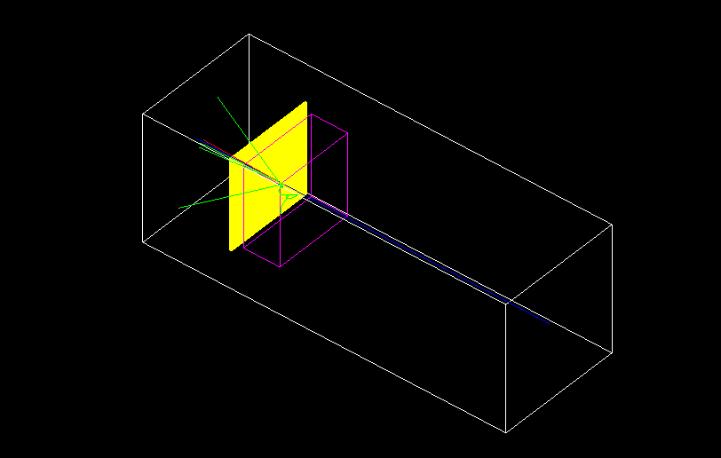

# Geant4 Example

This example makes use of the _Geant4_ particle-material interaction framework. In this scenario a proton beam is fired against a target of Beryllium.

## References

The example makes use of the tutorial series by Mustafa Schmidt on [Youtube](https://www.youtube.com/playlist?list=PLLybgCU6QCGWgzNYOV0SKen9vqg4KXeVL) and the code available [GitHub](https://github.com/MustafaSchmidt/geant4-tutorial).